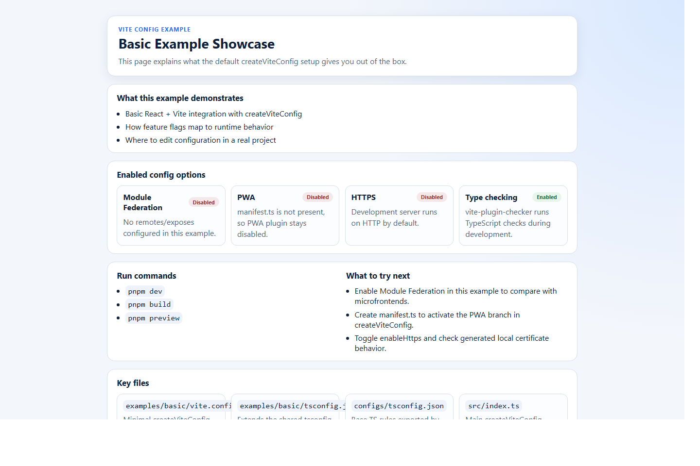
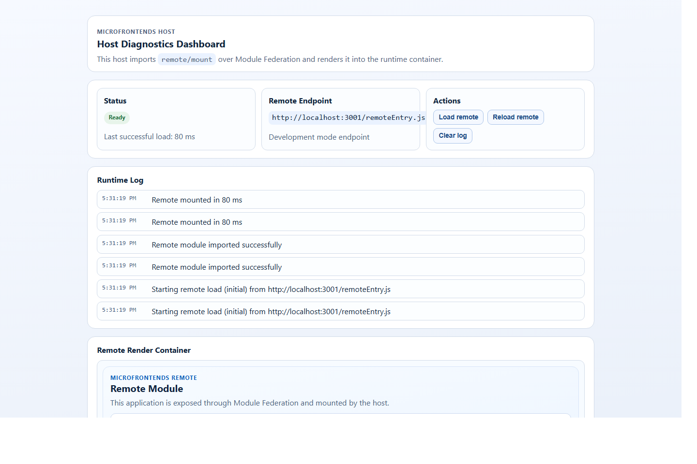
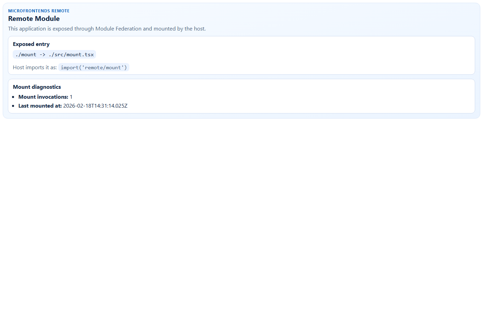

# Examples Overview

These examples are designed as a practical showcase for `@atomazing-org/vite-config`.

## Available examples

1. `examples/basic`
Basic setup with `createViteConfig` for a single React app.

2. `examples/microfrontends/remote`
Remote application that exposes `./mount` through Module Federation.

3. `examples/microfrontends/host`
Host application that imports `remote/mount` and renders it at runtime.

## Quick start

1. Basic example:
```bash
pnpm --dir examples/basic dev
```
Open `http://127.0.0.1:5173`.

2. Microfrontends (run in separate terminals):
```bash
pnpm --dir examples/microfrontends/remote dev
pnpm --dir examples/microfrontends/host dev
```
Open `http://127.0.0.1:3000`.

## Expected output

1. Basic:
You should see a dashboard that explains enabled/disabled config features and key files.

2. Host + remote:
Host should show load status and runtime logs. Remote should display mount diagnostics.

## Screenshots

Basic dashboard:



Host dashboard:



Remote dashboard:



To refresh screenshots after UI changes:

```bash
pnpm capture:examples:screenshots
```

## Troubleshooting

1. Port already in use:
Stop previous dev processes or change ports in each example `vite.config.ts`.

2. Host cannot load remote:
Start `remote` first, then `host`, and check that `http://127.0.0.1:3001/remoteEntry.js` is reachable.

3. TypeScript errors for federation imports:
Ensure `examples/microfrontends/host/src/vite-env.d.ts` contains `declare module 'remote/mount'`.
